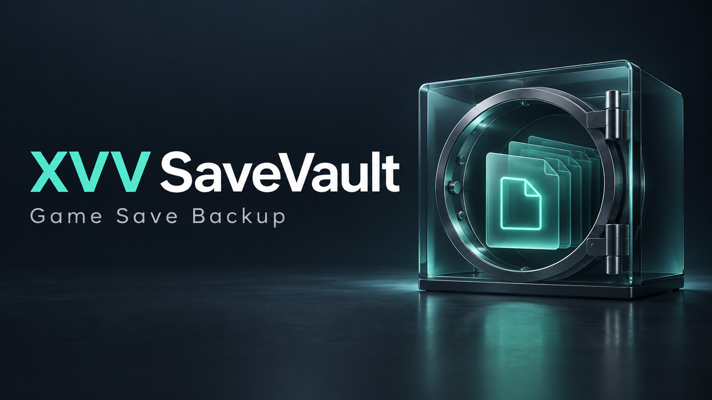

# XVV SaveVault 1.0



<p align="center">
<a href="https://github.com/iflaholmaz/XVV-SaveVault/archive/refs/heads/main.zip"></a>
<a href="#kullanım"></a>
</p>

*Kapak bir tanıtım görselidir; uygulama ekran görüntüsü değildir.*

Oyun kayıt klasörlerinizi tarihli ZIP dosyalarına yedekleyen bağımsız Windows uygulaması. Windows PowerShell 5.1 ve WPF; Türkçe ve İngilizce arayüz.

## Kullanım

1. ZIP paketini tamamen çıkarıp **Start.cmd** dosyasını çalıştırın.
2. **Oyun ekle** ile yalnızca ilgili oyunun kayıt klasörünü seçin ve adını yazın.
3. Oyunu kapatın, bulut eşitlemesinin tamamlanmasını bekleyin ve **Şimdi yedekle** düğmesine basın.
4. Geçmişten bir yedek seçerek **Yedeği doğrula** veya **Geri yükle** kullanın.
5. **Yedek konumu ve ayrıntılar** bölümünden yerel klasör veya harici disk seçebilirsiniz. Konumu değiştirmek eski yedekleri taşımaz; eski konumu tekrar seçerek onları görebilirsiniz.

## Geri yükleme davranışı

- Arşivdeki dosya yolları, profil kimliği ve SHA-256 değerleri kontrol edilir.
- Mevcut kayıt dosyaları varsa önce BeforeRestore türünde bir güvenlik ZIP'i oluşturulur. Bu başarısız olursa geri yükleme yapılmaz.
- Arşiv ayrı bir geçici klasöre çıkarılıp doğrulanır.
- Mevcut klasör `.SaveVault-before-...` adlı komşu klasöre taşınarak korunur; hazırlanan klasör kayıt klasörünün yerini alır.
- Böylece yedekte olmayan sonradan eklenmiş dosyalar aktif kayıt klasöründe kalmaz; önceki klasör ve güvenlik yedeğinde korunur.
- Kaynak klasör silinmiş veya boşsa da geri yükleme yapılabilir. Olmayan dosyalar için güvenlik ZIP'i oluşturulmaz; mevcut boş klasör korunur.
- Son taşıma başarısız olursa önceki klasör yerine konmaya çalışılır. Başarısız hazırlık klasörleri incelemek için tutulur. Elektrik kesintisi gibi durumlarda durum mesajını ve `.SaveVault-before-...` klasörünü inceleyin.

## Veriler nerede?

- Profiller ve dil: `%LOCALAPPDATA%\XVV SaveVault\profiles.json`.
- Önceki profil dosyası: aynı konumda `profiles.json.previous`.
- Varsayılan yedekler: Belgeler klasöründeki `XVV SaveVault Backups`.
- ZIP dosyaları profil kimliğine göre alt klasörlerde saklanır; dosya adları UTC zamanını içerir, arayüz yerel zamanı gösterir.
- Listeden kaldırma, kayıtları ve ZIP'leri silmez. Aynı oyunu yeniden eklemek yeni profil kimliği oluşturur; eski profili geri almak için önceki yapılandırma dosyasını ve ZIP'leri saklayın.

## Sınırlar

Bu ilk sürümde kayıt klasörü elle seçilir. Oyunları otomatik tanıma, zamanlanmış yedek, bulut servis bağlantısı, yedek silme veya şifreleme yoktur. Steam/Epic/diğer bulut kayıtlarını yönetmez. Geri yüklemeden önce bulut eşitlemesini duraklatın; aksi halde servis geri yüklediğiniz kayıtları değiştirebilir.

Dosya kilitleri kısmi yedeğin tamamlanmış olarak yayımlanmasını engeller; ancak çalışan bir oyunun birden çok dosyası için anlık görüntü garantisi verilmez. Oyunu kapatın. Boş klasörler ve NTFS izinleri/alternatif veri akışları yedeklenmez; dosya içerikleri, alt klasör yolları ve değiştirme zamanları korunur. Bağlantılı klasörler/junction/symlink, sistem klasörleri ve kayıtlarla örtüşen yedek klasörleri reddedilir. Eski klasörler ve güvenlik ZIP'leri disk alanı kullanır. Yedekleme/geri yükleme için yeterli boş alan bırakın.

ZIP'ler şifresizdir ve oyun hesabına ilişkin veriler içerebilir. Uygulama internete veri göndermez. Başlatıcının ExecutionPolicy ayarı yalnızca açılan PowerShell sürecine uygulanır. Windows 10/11 masaüstü ve Windows PowerShell 5.1 gerekir; PowerShell 7 hedeflenmez. Yönetici yetkisi normal kullanımda gerekmez.

## English

Extract the package and run **Start.cmd**. Add a game by choosing its dedicated save folder, close the game and let cloud sync finish, then select **Back up now**. Pick a backup to verify SHA-256 checksums or restore. Restore validates the archive, backs up existing files, stages the snapshot and preserves the previous folder before replacement. Missing or empty registered save folders are supported. Backup folders can be on a local or external drive; changing the location does not move old files.

Profiles are stored under LocalAppData; backups default to Documents/XVV SaveVault Backups. Backups are not encrypted. No automatic game discovery, scheduler, cloud integration or backup deletion is included. Empty directories, ACLs and alternate data streams are not preserved. Close games and pause cloud sync before restore. The app keeps safety copies, so allow sufficient disk space.

## Doğrulama / Verification

```powershell
powershell.exe -NoProfile -STA -ExecutionPolicy Bypass -File .\Verify.ps1
```

Testler yeni bir geçici test klasörü oluşturur ve örnek dosyalarla çalışır; gerçek oyun kayıtlarını kullanmaz. İncelemek için test klasörü tutulur. Arşiv, yeniden yükleme, eksik/boş klasör, bozulmuş yedek, yol taşması, dosya kilitleri ve WPF arka plan yedekleme testleri içerir.
